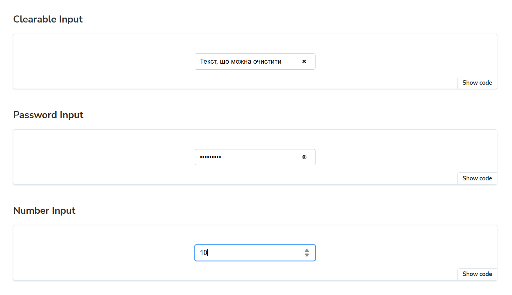
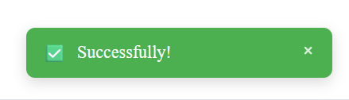
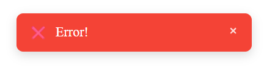
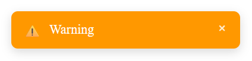
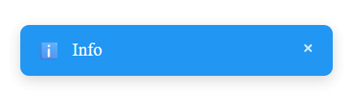

This repository contains a small reusable UI component library, developed using React and TypeScript, with demonstration provided in **Storybook**.

🚀 **Setup and Launch Instructions**
Follow these steps to run the project locally:

- Clone the repository
- Install dependencies
- Launch Storybook using the command: npm run storybook (or yarn storybook)

**Components**

The **Input** component is a controlled component that supports enhanced functionality: various type support, clearing capability, and password visibility toggling.

**Functionality**

_Multi-type_: Supports text, number, email, and password types.

_Password Toggle_: If type="password", an icon is displayed to toggle visibility.

_Clearable_: If true, an '✕' button appears to reset the field's value to an empty string (or 0 for type="number").

_Controlled_: The component uses the value and onChange props.

The **Toast** component is a non-intrusive feedback mechanism used to display brief, temporary messages to the user. It is configured to appear at the bottom-right of the viewport.

**Functionality**

_Variants_: Supports four semantic types for visual feedback: success, error, warning, and info.

_Auto-dismiss_: The notification automatically disappears after a specified duration (default 5000ms). Setting duration=0 disables auto-dismissal.

_Manual Close_: An optional manual close button (✕) is available via the isClosable prop.

